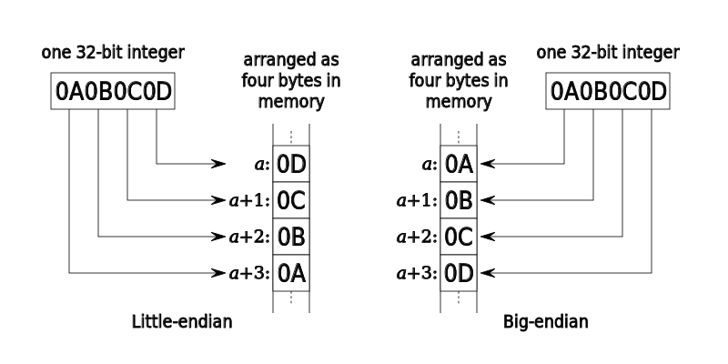

# OS level data fundamentals

The rudimentary level of data transfer was through switches and this led to primary representation as a bits 0 or 1 with roughly translates to switch being off or on; or even boolean true or false. 

Interestingly enough any character in the world can be represented as bits made possible by ASCII. what is ASCII (American Standard Code for Information Interchange) consider this as timezones defined to avoid confusion between communicating parties.

## primary memory

## secondary memory

## page

## page table 

## page frame

## paging

## Endianness

Since it is established that the data represent for any computing device is generally found to be bits. Without getting into depths of CPU architechure which can be further discussed in the further literature -- word are the amount of data CPU can hold in one clock cycle generally equates to the total size of registers. Endianness is order in which the word data is store 

